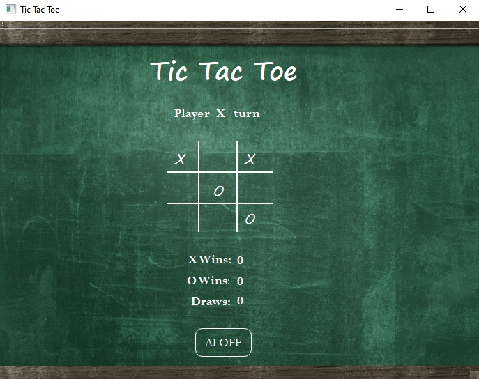

# Tic Tac Toe QtApplication

I was able to learn Qt's framework to implement my C++ code and create a GUI of the game Tic Tac Toe. 
Within Qt, I was able to modify the CSS to give the game a chalkboard look and feel when playing the game.

The Game is either 2 players or 1 player against an A.I.
The game implements a basic A.I. that will win or block you depending whats on the board.

